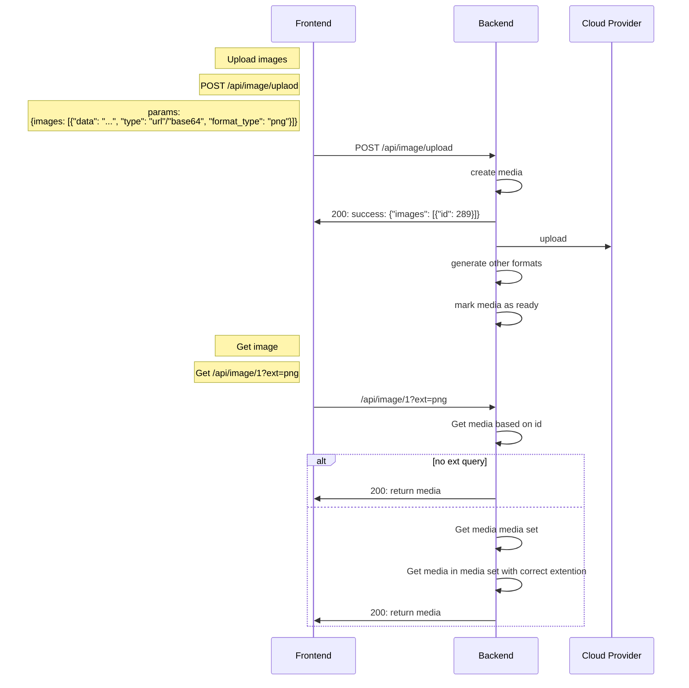

# Pencil Policy Server [](https://bob.trypencil.com/job/policy-server/)

### App Structure

```bash
/src
  /controllers
  /db # db anddata models
  /enums
  /tmp # to store files locally
  /utils # helper functions
/test
  /unit # unit tests
app.js # express app
index.js # server entry point
```

### Migrations

- sequelize-cli is used to manage db schema migrations
- Apply migrations `env-cmd -f ./.env npx sequelize db:migrate `
- Rollback `env-cmd -f ./.env npx sequelize db:migrate:undo`
- Creating migration `env-cmd -f ./.env npx sequelize migration:generate --name xxxxx`

### Development

- Install dependencies `yarn`
- Duplicate `.env.example` as `.env`
- run `npm install -g env-cmd`
- Update env vars in `.env`
- Start services `env-cmd -f ./.env yarn dev `


### Testing
- Start services `env-cmd -f ./.env yarn test `


### API Diagram


